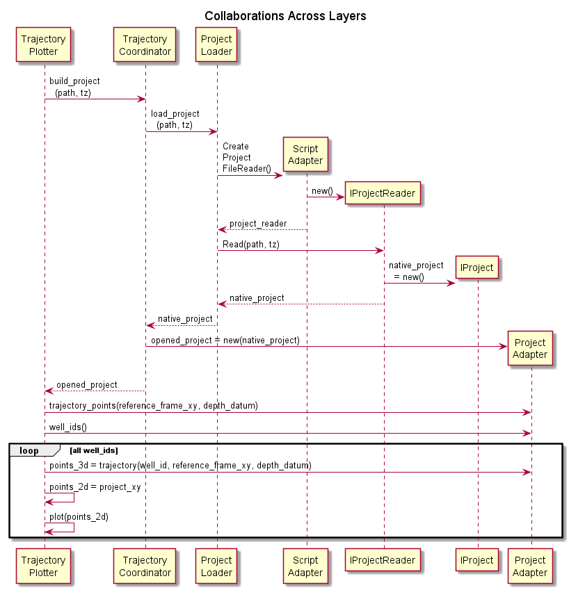
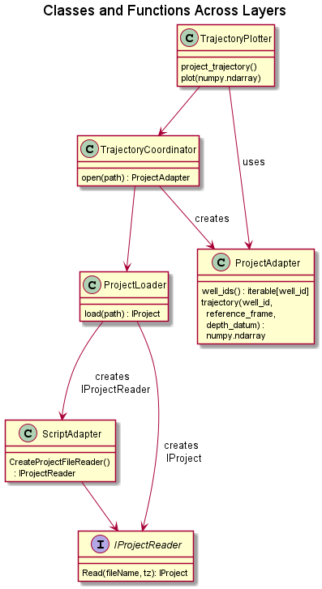

# Developer README

## Purpose and Scope

This document provides an overview of the ImageFrac4 Python API for developers. It models the overall 
structure of the package and its demo applications.

### WARNING: Just Sketches

The diagrams modeling our structure and collaborations are _just sketches_. The collaboration and class 
diagrams are not guaranteed to be consistent. Further, the author fully expects that implementing the package
 and demo applications will uncover details that are not covered by these UML models.

## Layers

The following diagram models the collaboration between classes and functions across layers of the application
 and package. Remember that, because Python does not require objects, a number of "classes" in the model may 
 simply be Python functions.

The next diagram models the classes and functions but assigns them to layers. Again, a class in the UML model 
may actually be a simple python function.

